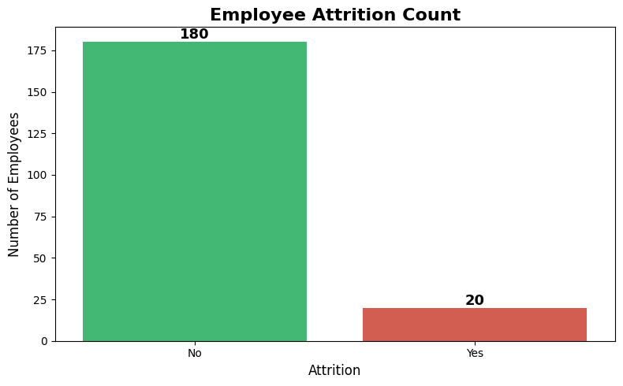
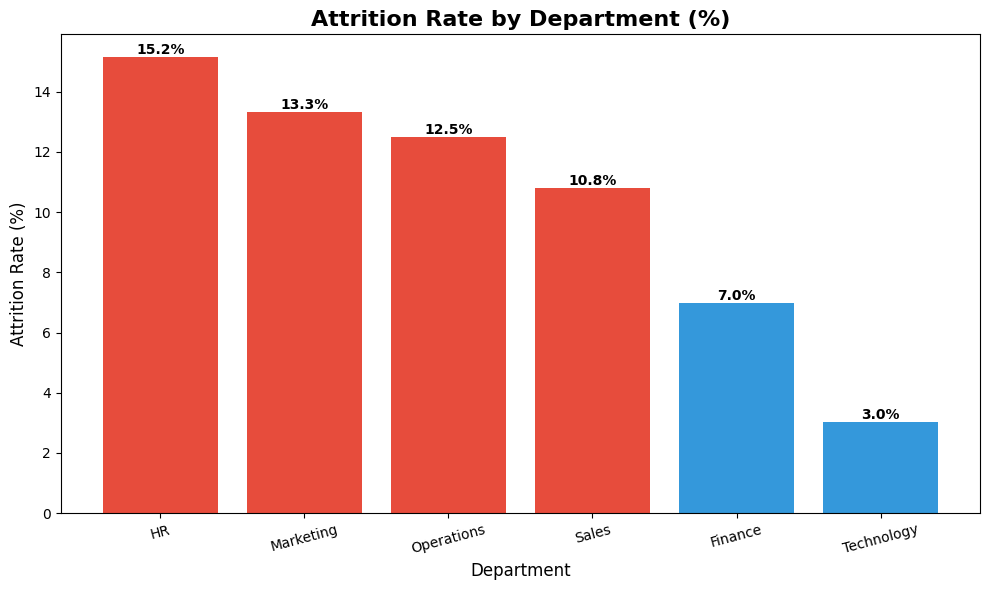
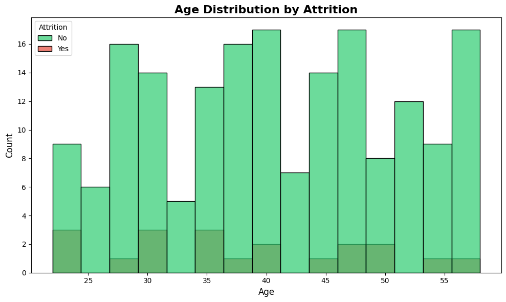
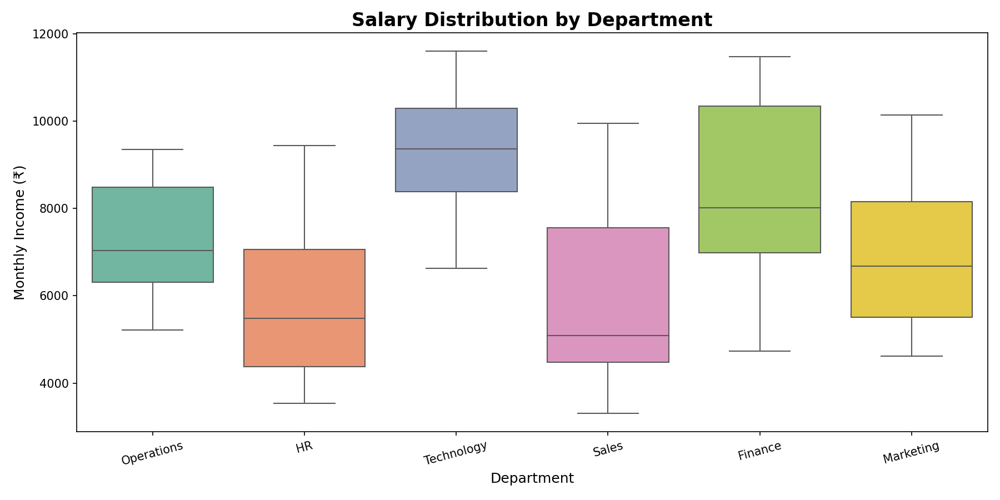
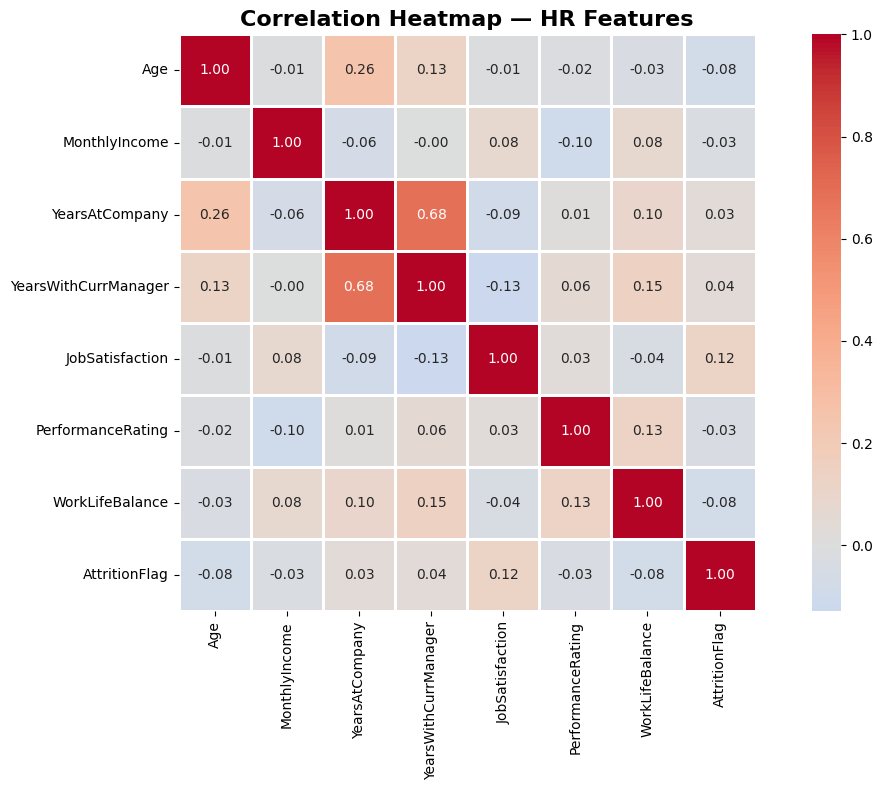

# 📊 HR Employee Attrition & Workforce Analytics Dashboard


## 📌 Project Overview
An end-to-end HR Analytics project analyzing employee attrition, 
salary distribution, and job satisfaction across departments.
Built as a fresher Data Analyst portfolio project.

## 🎯 Business Problem
Employee attrition impacts hiring costs, productivity, and workforce stability. This project analyzes attrition patterns, salary disparities, and employee satisfaction to support data-driven HR decisions.

## 🛠️ Tools Used
| Tool | Purpose |
|------|---------|
| Excel | Data cleaning, XLOOKUP, Pivot Tables, Dashboard |
| MySQL | Database creation, 8 SQL queries |
| Python | EDA, Data Visualization |
| Power BI | Interactive Dashboard |

## 📁 Project Structure
```
HR-Employee-Analytics/
├── data/
│   └── HR_Employee_Data.csv
├── excel/
│   └── HR_Employee_Dataset.xlsx
├── sql/
│   └── hr_queries.sql
├── python/
│   ├── HR_Analysis.ipynb
│   └── charts/
└── README.md
```

## 📊 Dataset
- 200 employees across 6 departments
- 18 features including Age, Salary, Attrition, JobRole
- 10% overall attrition rate

## 🔍 Key Insights
- 🔴 HR department has highest attrition **(15.2%)**
- 🟢 Technology has lowest attrition **(3.0%)**
- ⚠️ Employees with OverTime leave **40% more**
- 💰 IT Manager is highest paid role **(₹10,627 avg)**
- 👥 26-35 age group has highest attrition count

## 📸 Dashboard Preview

### Employee Attrition Count


### Attrition Rate by Department


### Age Distribution by Attrition


### Salary Distribution by Department


### Correlation Heatmap — HR Features


## 📈 Excel Analysis
- ✅ Data cleaning and formatting
- ✅ XLOOKUP with 4 use cases
- ✅ 5 Pivot Tables
- ✅ Interactive Dashboard with slicers

## 🗄️ SQL Queries
- Attrition rate by department
- Average salary by job role
- Window functions (RANK)
- CTEs for high risk employees

## 🐍 Python Visualizations
- Attrition count bar chart
- Attrition rate by department
- Salary distribution boxplot
- Age distribution histogram
- Correlation heatmap

## 💼 Skills Demonstrated
- HR Analytics
- Employee Attrition Analysis
- SQL Querying
- Python EDA
- Dashboard Design
- Business Intelligence
- KPI Reporting
- Workforce Analytics

## 🚀 Conclusion
This project demonstrates end-to-end data analytics capabilities using Excel, SQL, Python, and Power BI to solve practical HR business challenges and improve workforce retention strategies.

## 👤 Author
**mariselvan1529**  
Fresher Data Analyst | Excel · SQL · Python · Power BI
